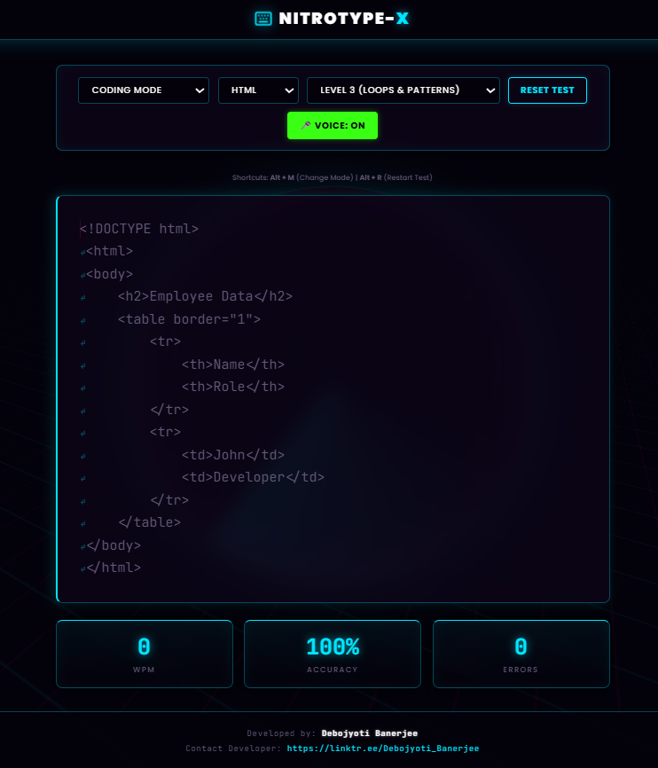

# NitroType-X (Typing Master)

 

NitroType-X is an advanced, cyberpunk-themed typing speed tester designed to help users improve their typing speed across standard text and programming languages. It features a custom Web Audio engine that simulates mechanical keyboard sounds and a Web Speech API integration for hands-free voice control.

## 🚀 Features

*   **Immersive Cyber-Neon UI:** Dark mode interface with glowing cyan accents, pure CSS 3D rotating cyber-grids, and glassmorphism panels.
*   **Multiple Typing Modes:**
    *   *Paragraph Mode:* Standard English practice.
    *   *Coding Mode:* Practice real syntax for HTML, Python, C++, and Java.
    *   *Custom Mode:* Paste your own text or code to practice.
    *   *Free Type Mode:* Pure speed testing without a predefined prompt.
*   **Voice Control:** Navigate modes, select levels, and restart tests hands-free using voice commands (e.g., "coding", "HTML", "level 3", "restart").
*   **Mechanical Keyboard SFX:** Built-in Web Audio API synthesizes a satisfying "khat khat" mechanical switch sound for correct keystrokes and a sharp buzz for errors.
*   **Real-Time Analytics:** Live tracking of WPM (Words Per Minute), Accuracy, and Errors.
*   **Keyboard Shortcuts:** `Alt + M` to toggle modes, `Alt + R` to instantly restart.

## 🛠️ Tech Stack

*   **HTML5:** Semantic structure and layout.
*   **CSS3:** CSS Variables, Flexbox, Glassmorphism, CSS Animations, and 3D Transforms.
*   **Vanilla JavaScript:** Core logic, Web Audio API (Sound Engine), and Web Speech API (Voice Recognition).

## 💻 How to Run Locally

1. Clone this repository or download the files.
2. Ensure all files (`index.html` and `style.css`) are in the same folder.
3. Open `index.html` in any modern web browser (Chrome or Edge recommended for Voice Control features).

## 👨‍💻 Developer

**Debojyoti Banerjee**
*   [Linktree](https://linktr.ee/Debojyoti_Banerjee)
